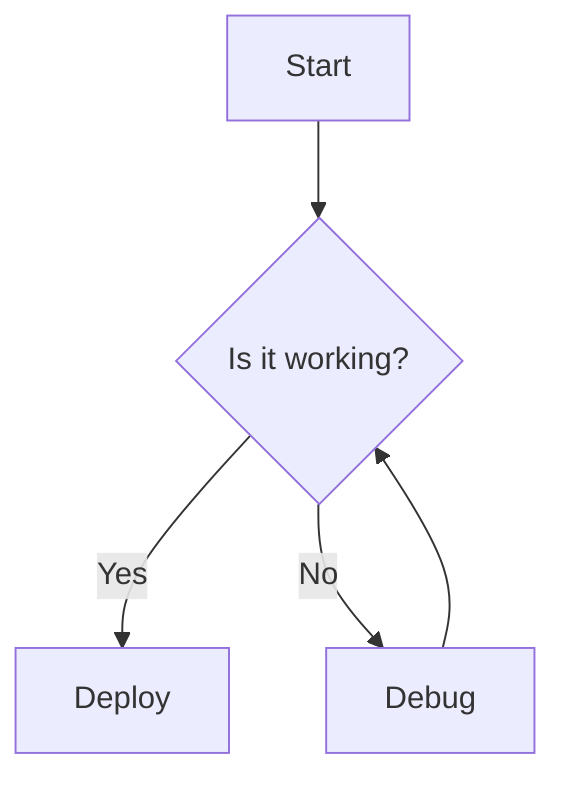
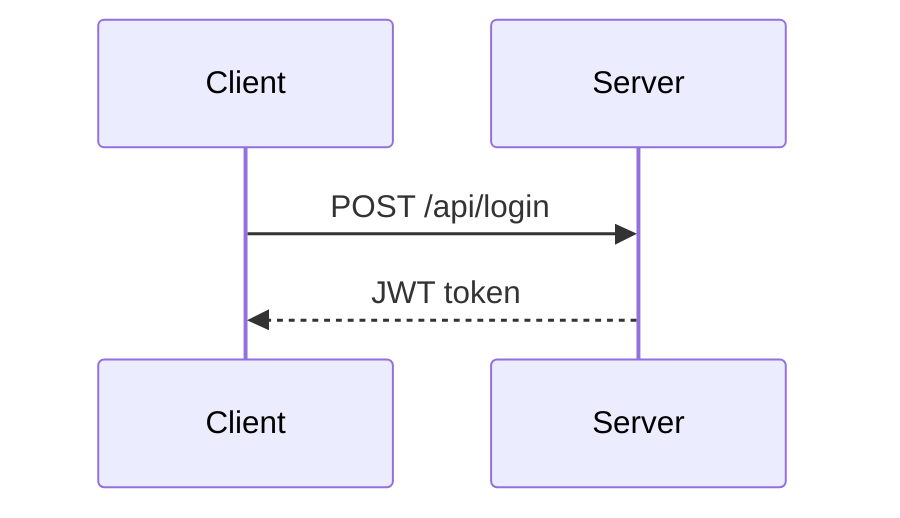

# Example: Mermaid Diagrams

mcp-md2pdf renders Mermaid diagrams offline.

## Flowchart



## Sequence Diagram



## In a PDF tool call

```json
{
  "markdown": "## Architecture\n\n```mermaid\ngraph TD\n  A[Client] --> B[API]\n  B --> C[Database]\n```",
  "theme": "github"
}
```
